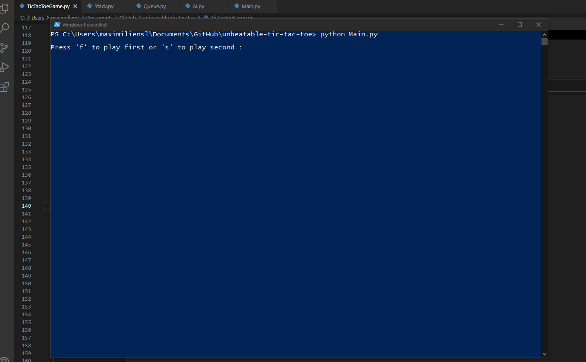

# Unbeatable Tic Tac Toe

## Preview

## How To Run This Program

First, make sure [Python 3.7+](https://www.python.org/downloads/) and [pip](https://pypi.org/project/pip/) are installed on your computer.

Then install the Numpy module :

	pip3 install numpy
  
Now run the program with the following command :

	python Main.py
  
## Description

This is a tic tac toe game where the player can't ever hope to win against the AI. The program uses the [Minimax algorithm](https://www.geeksforgeeks.org/minimax-algorithm-in-game-theory-set-1-introduction/)
to determine what are the best moves for the AI to play in order to prevent the player from winning.
